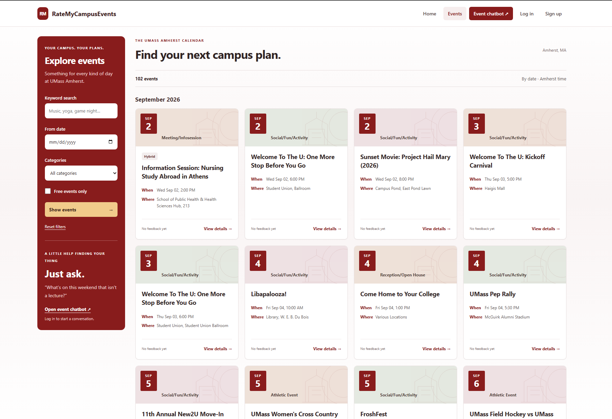

# RateMyCampusEvents

RateMyCampusEvents helps UMass Amherst students discover campus events. Browse the calendar by date and category, then ask the event chatbot for recommendations grounded in the official UMass Amherst events calendar.



## Highlights

- Browse upcoming events in a chronological calendar.
- Filter by keyword, date, category, and free admission.
- Ask questions such as “What is happening this weekend?” or “Find free events next week.”
- View event details, locations, organizers, and source links.
- Create an account with email and password, Google, or GitHub.
- Rate events and join the discussion with comments.

## Documentation

- [Install and run locally](docs/installation.md)
- [Technical architecture](docs/architecture.md)
- [Testing guide](docs/testing.md)
- [Deployment guide](docs/deployment.md)

## Built with

- FastAPI and Jinja2 for server-rendered pages
- HTMX for page interactions
- PostgreSQL, pgvector, SQLModel, and Alembic for data and migrations
- OpenAI or Google Gemini for semantic event search and responses
- JWT and OAuth for authentication

## Project layout

```text
app/          Application code: routes, database access, ingestion, search, pages, and static files
migrations/   Alembic database migrations
templates/    Jinja templates, including reusable fragments
docs/         Installation, architecture, testing, and deployment documentation
.github/      Continuous integration and scheduled workflows
```

## Quick start

See the [installation guide](docs/installation.md) for the complete setup. At a minimum, create a PostgreSQL container with pgvector, install the Python requirements, configure environment variables, run migrations, import events, and start the app.

```powershell
uvicorn app.main:app --reload
```

Visit [http://localhost:8000](http://localhost:8000).

## Contributing

Please read the [testing guide](docs/testing.md) before opening a pull request.
