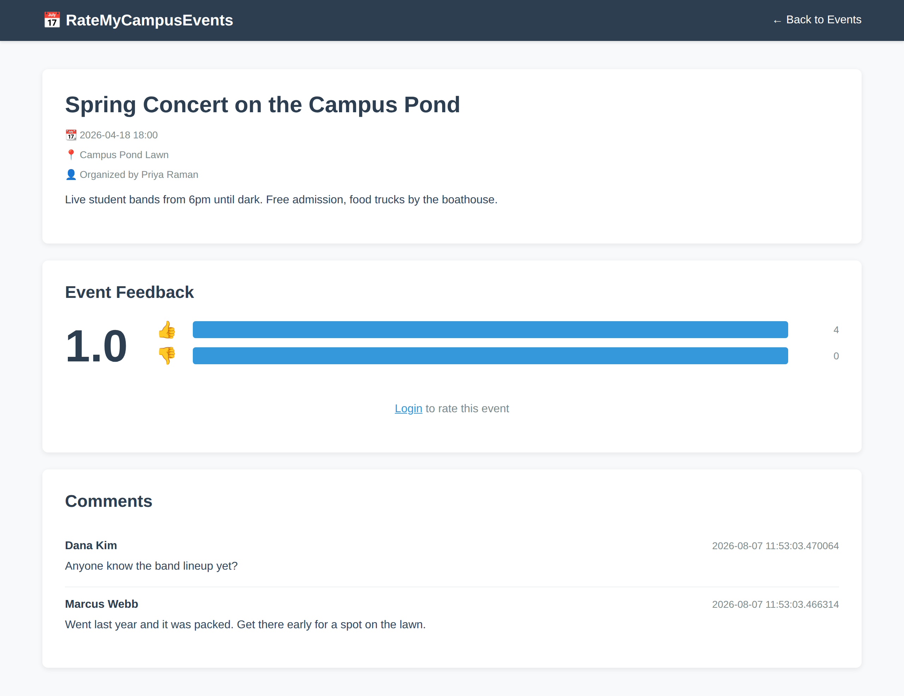

# RateMyCampusEvents

A web application for students and organizers to view, rate, and comment on campus events. Built with FastAPI, PostgreSQL, HTMX, and SQLModel.

## Prerequisites

Python 3.13+
Docker (for PostgreSQL)
pip (Python package manager)

## HOW TO SETUP&&RUN 

### Step 1: Clone/Navigate to the Project Directory

cd "projects/ratemycampusevents"

### Step 2: Install the requirements

pip install -r requirements.txt

### Step 3: Start PostgreSQL Database

The project uses a PostgreSQL Docker container. It must have the `pgvector`
extension available -- semantic search stores its vectors in Postgres, and
`alembic upgrade head` fails on a stock `postgres` image with
`extension "vector" is not available`. The `pgvector/pgvector:pg16` image works
as a drop-in replacement.

Start it with:

sudo chgrp "$(id -gn)" /var/run/docker.sock
sudo chmod g+rw /var/run/docker.sock

./.devcontainer/tasks/svc-up.sh

**Or**

sudo docker start dev_pg

## You should see output showing the `dev_pg` container is running.

### Step 4: Database Configuration

The application uses these default PostgreSQL settings:

- **Host**: `dev_pg`
- **Port**: `5432`
- **Database**: `db`
- **Username**: `app`
- **Password**: `app`

**You can config them in `app/core/config.py`**

export DATABASE_USER="your_user"
export DATABASE_PASS="your_password"
export DATABASE_HOST="your_host"
export DATABASE_PORT="5432"
export DATABASE_NAME="your_database"

### Step 5: Run Database Migrations

The schema is managed by Alembic, not by the app. Create/update the tables with:

alembic upgrade head

Run this after every `git pull` that touches `migrations/`. Useful extras:

alembic current            # what revision the database is on
alembic upgrade head --sql # print the SQL without running it
alembic downgrade -1       # roll back one revision

### Step 5b: Sign-in with Google or GitHub (optional)

Local email/password accounts keep working with no configuration. To offer the
provider buttons as well, create an OAuth app with each provider and export its
pair:

export GOOGLE_CLIENT_ID="..."
export GOOGLE_CLIENT_SECRET="..."
export GITHUB_CLIENT_ID="..."
export GITHUB_CLIENT_SECRET="..."

The callback URL to register with the provider is
`<your host>/auth/google/callback` and `<your host>/auth/github/callback`.
A provider whose pair is missing simply does not get a button.

Accounts are linked on email, so signing in with Google as someone who already
registered with a password lands in the same account. Only addresses the
provider has verified are accepted.

Also set `SECRET_KEY` anywhere real -- the fallback is committed to this
repository and signs both the JWTs and the OAuth session cookie:

export SECRET_KEY="$(python -c 'import secrets; print(secrets.token_hex(32))')"

### Step 6: Build the Search Index

Embeddings are generated by Gemini, so the chatbot needs an API key:

export GEMINI_API_KEY="your_key"

Then embed every event:

python -m app.ingest.localist   # pull events from the UMass calendar
python -m app.rag.backfill      # embed them

Both are safe to re-run. The backfill only spends an API call on events whose
text actually changed, so a second run embeds nothing.

To exercise either without a key, set `RAG_PROVIDER=fake` -- it swaps in a
deterministic local stand-in. Useful for testing, useless for real search.

### Step 7: Run the Application

Start the FastAPI server:

uvicorn app.main:app --reload

### Step 8: Access the Application

Open your web browser and navigate to:

http://localhost:8000

## Running the tests

pytest

The retrieval tests stub out the model and the database, so they need neither
an API key nor a running Postgres.

## How TO TEST IT

### 1. Create an Event

**Once logged in:**
1. Click the "Create Event" button
2. Fill in the event details:
   - Title
   - Description
   - Date & Time 
   - Location
3. Click "Create Event"
4. **The event will appear on the home page**

### 2. Delete  Comment

**On your own comment:**
1. You'll see a red "Delete" button on comments you created
2. Click "Delete"
3. Confirm the deletion
4**You should see your comment deleted**

### 3. Test Data Persistence

**Verify data persists across restarts:**
1. Create some events, comments, and ratings
2. Stop the server (Ctrl+C)
3. Restart the server: `uvicorn app.main:app --host 0.0.0.0 --port 8000 --reload`
4. Go to `http://localhost:8000`
5. **All your data is still there!** 
